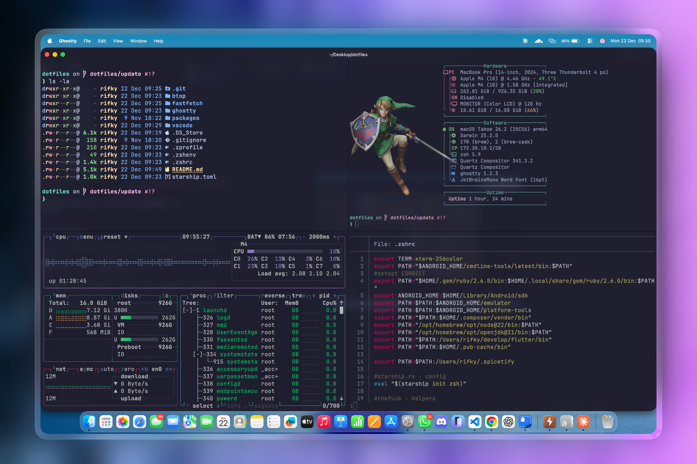

# Dotfiles


[](https://ghostty.org/)
[](https://www.zsh.org/)
[](https://starship.rs/)
[](https://code.visualstudio.com/)
[](https://brew.sh/)
[](https://claude.ai/)

<div align="center">
  
</div>

My personal macOS configuration files and settings.

## Core Tools

**Terminal & Shell:** Ghostty, Zsh, Starship Prompt
**Development:** VS Code, Claude Code

## System

**Monitoring:** btop, fastfetch  
**Package Manager:** Homebrew


## Quick Start

> [!NOTE]
> This is a **manual copy setup**, not using symlinks. You'll need to manually copy files when updating.

### Prerequisites

```bash
# Install Homebrew (if not installed)
/bin/bash -c "$(curl -fsSL https://raw.githubusercontent.com/Homebrew/install/HEAD/install.sh)"
```

### Installation

1. **Clone this repository**
   ```bash
   git clone https://github.com/rifk7s/dotfiles.git
   cd dotfiles
   ```

2. **Copy shell configurations**
   ```bash
   cp .zshrc ~/.zshrc
   cp .zprofile ~/.zprofile
   cp .zshenv ~/.zshenv
   cp starship.toml ~/.config/starship.toml
   ```

3. **Copy Ghostty configuration**
   ```bash
   mkdir -p ~/Library/Application\ Support/com.mitchellh.ghostty
   cp ghostty/config ~/Library/Application\ Support/com.mitchellh.ghostty/config
   ```

4. **Copy VS Code settings**
   ```bash
   cp vscode/settings.json ~/Library/Application\ Support/Code/User/settings.json
   cp vscode/keybindings.json ~/Library/Application\ Support/Code/User/keybindings.json
   ```

5. **Copy other tool configs**
   ```bash
   cp -r btop ~/.config/btop
   cp -r fastfetch ~/.config/fastfetch
   ```

6. **Copy Claude Code settings**
   ```bash
   mkdir -p ~/.claude
   cp claude/settings.json ~/.claude/settings.json
   cp claude/claude-powerline.json ~/.claude/claude-powerline.json
   ```

7. **Restore Claude Code memory (optional)**
   ```bash
   mkdir -p ~/.claude/projects/-Users-rifky-Desktop-alp-dueday/memory
   cp -r claude/memory/* ~/.claude/projects/-Users-rifky-Desktop-alp-dueday/memory/
   ```

8. **Reload shell**
   ```bash
   source ~/.zshrc
   ```

> [!TIP]
> After copying configs, restart your terminal or reload the shell for changes to take effect.

## Features

### Ghostty Terminal
- **Theme:** Catppuccin Mocha
- **Font:** JetBrainsMono Nerd Font (16pt)
- **Background:** Blur effect with 75% opacity
- **Shell Integration:** Full SSH support with terminfo auto-install
- **Custom Shaders:** Not included in this repo (personal preference)

> [!NOTE]
> Ghostty shaders are stored locally and not synced to this repo. If you want to use custom shaders, check out [hackrmomo/ghostty-shaders](https://github.com/hackrmomo/ghostty-shaders) for examples.

### Zsh Configuration
- Homebrew integration
- Python 3.14 PATH setup
- uv (Python package installer) PATH
- Bun runtime setup
- MySQL client + DBngin helper (`mysqls` function)
- Laravel Herd (PHP, Composer, NVM)
- Custom aliases (`eza`, `lstr`, `gitlog1/2`, `fzf`)
- Antigravity, OpenCode, LM Studio PATH

### Starship Prompt
- Modern, fast, and customizable prompt
- Git status integration
- Language version indicators
- Execution time display

### VS Code
- Moonlight II theme
- Fluent Icons
- Custom keybindings
- Enhanced editor settings

### Claude Code
- Powerline status line with rose-pine theme
- Plugins: frontend-design, context7, andrej-karpathy-skills, figma
- Pre-tool-use hooks (rtk)
- Worktree with `fresh` base ref
- Auto-compact enabled
- Memory backup (11 feedback files for project preferences)

> [!NOTE]
> Claude Code settings use native auth (no API keys in config). Memory files in `claude/memory/` are project-specific backups that can be restored after a clean install.

## Package Lists

> [!IMPORTANT]
> Package lists are for reference only. Review packages before mass installation.

The `packages/` directory contains lists of installed packages:
- **brew-packages.txt** - Homebrew formulae
- **brew-casks.txt** - Homebrew casks (apps)
- **npm-packages.txt** - npm global packages

To export your current packages:

```bash
# Export Homebrew packages
brew leaves > packages/brew-packages.txt
brew list --cask > packages/brew-casks.txt

# Export npm packages
npm list -g --depth=0 > packages/npm-packages.txt
```

## Customization

### Changing Ghostty Theme

Edit `ghostty/config`:
```bash
# Available themes: Catppuccin Mocha, Catppuccin Latte, Vesper, etc.
theme = Catppuccin Mocha
```

### Changing Starship Prompt

Edit `starship.toml` to customize your prompt. See [Starship documentation](https://starship.rs/config/) for options.

### Adding VS Code Extensions

Export your current extensions:
```bash
code --list-extensions > vscode/extensions.txt
```

## Troubleshooting

> [!WARNING]
> Common issues and their solutions are listed below.

### Shell not loading configs

```bash
# Make sure files are in the right location
ls -la ~/ | grep "^\.zsh"

# Reload shell
source ~/.zshrc
```

### Ghostty config not applied

```bash
# Check config location
ls -la ~/Library/Application\ Support/com.mitchellh.ghostty/

# Reload Ghostty config
# Press: super+r (or cmd+r)
```

### Starship prompt not showing

```bash
# Make sure starship is installed
brew install starship

# Check if it's in .zshrc
grep starship ~/.zshrc
```

## Notes

> [!NOTE]
> These dotfiles are configured for **macOS**. Some paths and configs may need adjustment for Linux.

- Configs are periodically updated as I refine my setup
- Not all configs may work out-of-the-box on your system
- Feedback and suggestions are welcome

